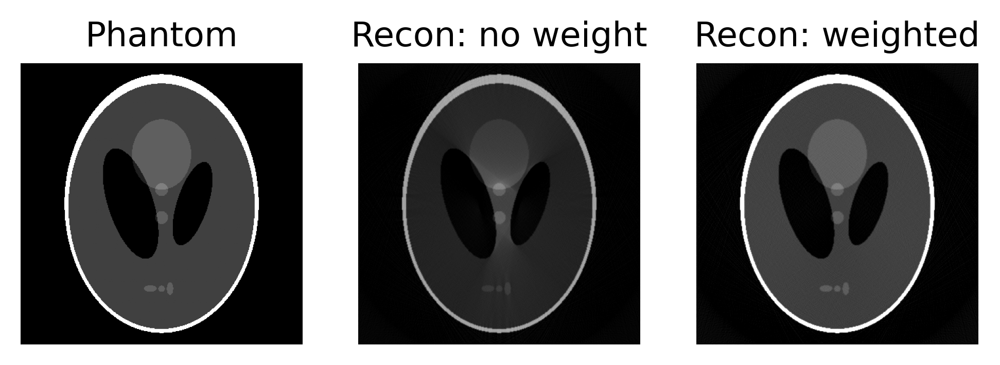

# offset-cone-beam-CT-reconstruction
Code to suport: "Extended Field-of-View X-Ray Attenuation, Phase, and Darkfield Microtomography using an Offset Cone-Beam Geometry", Harry Allan et al.

arXiv link: https://arxiv.org/abs/2502.10322

Scripts are provided to simulate central-slice sinograms of an offset cone-beam geometry, and then reconstruct using the demonstrated redundancy weighting scheme. While this code was written in the context of phase-sensitive imaging techniques, the weighting scheme applies equally to conventional tomography data. Two versions are supplied: one which uses fan-beam geometry definitions to allow a demonstration of the method using just a CPU (no GPU), and another using cone-beam geometry definitions (requires GPU) which is more readily adapted to a user's own cone-beam CT data. The fan-beam demonstration should run in just a few seconds on a basic PC.

Uses standard python packages in addition to the Astra toolbox (https://astra-toolbox.com/index.html).

Shepp-Logan computational phantom reconstructed with and without redundancy weights (post-convolution weighting, central-slice cone-beam geometry).
